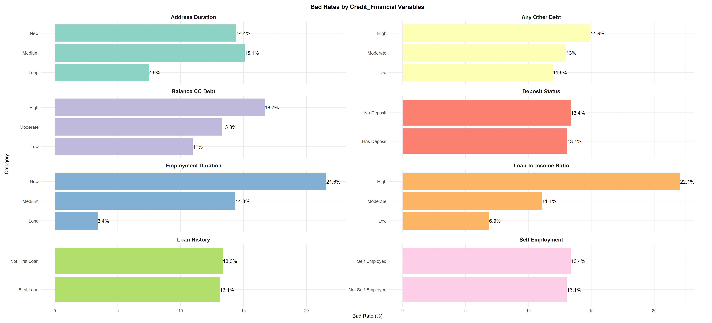
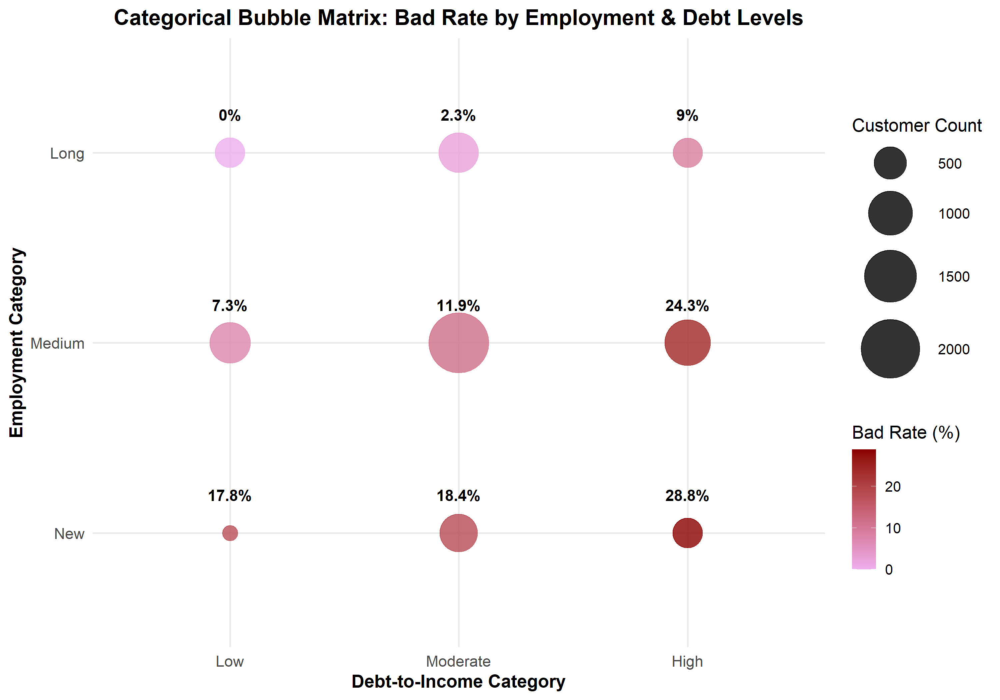
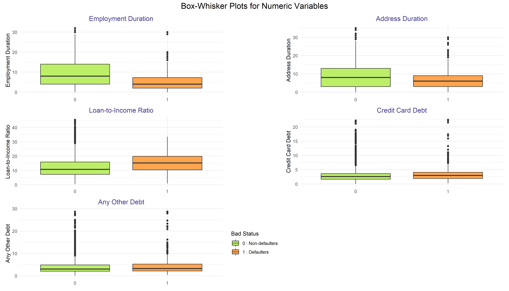
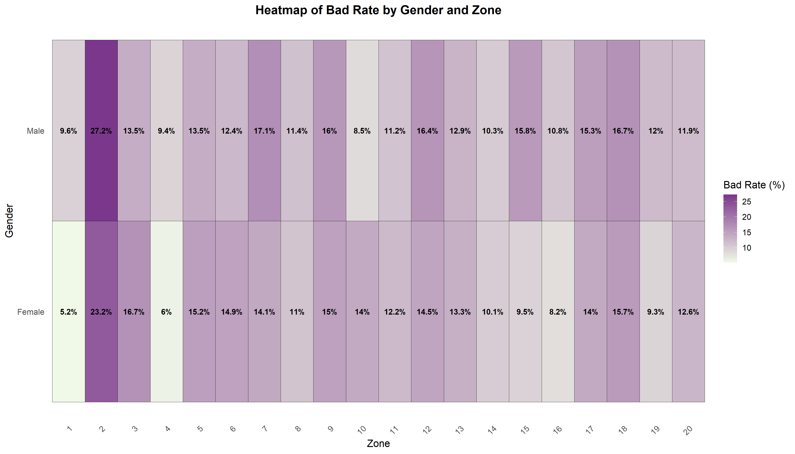
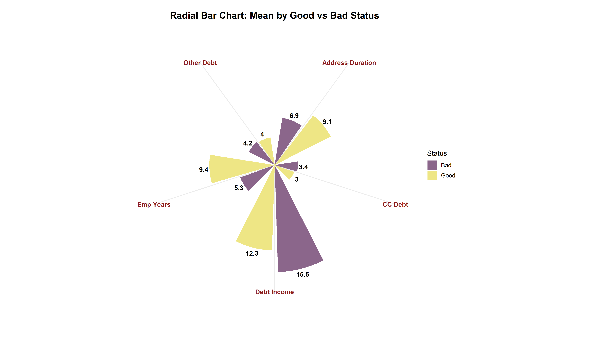

# 💳 Credit Scoring Analysis & Default Prediction

An **end-to-end Data Science project** focused on analysing and mitigating **credit default risk** in a retail banking context.   
This project demonstrates how credit risk decisions can be improved by combining **business-driven EDA**, **interpretable statistical models**, **machine learning**, and **customer sentiment analysis** to identify high-risk borrowers and service improvement opportunities.

---

## 🚀 Project Overview

This project aims to strengthen credit scoring practices by analysing **demographic, financial, and behavioural data**.   
The analysis follows a **structured five-phase data science lifecycle** commonly used in real-world risk analytics projects:

1. **Data Management**  
   - Understanding and validating multiple datasets  
   - Data cleaning, merging, and outlier handling  

2. **Exploratory Data Analysis (EDA)**  
   - Identifying key risk drivers  
   - Analysing defaulter (bad) rates across segments  

3. **Statistical Modeling**  
   - Developing a **credit scorecard** using Binary Logistic Regression  

4. **Machine Learning Comparison**  
   - Evaluating **Random Forest, Decision Tree, and Naïve Bayes** models  
   - Comparing performance using **ROC** and **AUC** metrics  

5. **Sentiment Analysis**  
   - Analysing customer feedback to assess service quality and pain points  

---

## 📊 Key Insights

- **Overall Default Rate:**  
  The overall defaulter rate in the dataset is **13.23%**.

- **Key Risk Drivers Identified:**  
  - **Financial Stress:** Customers with a **debt-to-income ratio above 16%** exhibit a significantly higher default rate of **22.1%**.  
  - **Employment Stability:** Customers with **less than 3 years of employment** show a default rate of **21.6%**, compared to **3.41%** for those employed for **more than 13 years**.  

- **Customer Sentiment:**  
  - Approximately **75% of customer feedback is positive**.  
  - Negative sentiment is primarily driven by **slow processing times** and **lack of proactive support**, highlighting operational improvement areas.

---

## 📈 Exploratory Data Analysis (EDA) - Key Visual Insights

### 🔍 Default Risk by Credit & Financial Factors
This visualization highlights how default risk increases sharply with **higher debt-to-income ratios** and **shorter employment duration**, confirming financial stability as a critical risk driver.

---

### 🔗 Interaction of Employment Stability & Debt-to-Income
The bubble matrix shows interaction effects between employment duration and debt burden.  
Newly employed customers with **high debt-to-income ratios** exhibit the **highest default risk**, while long-tenured customers remain low-risk across debt levels.

---

### 📦 Distribution of Numeric Risk Indicators (Good vs Bad)
Box-whisker plots compare numeric variables between defaulters and non-defaulters, showing that defaulters generally have **higher debt levels** and **shorter employment and address durations**.

---

### 🌍 Default Risk by Gender and Zone
This heatmap reveals geographic and demographic concentrations of default risk, helping identify **high-risk zones** and segment-level variations.

---

### 🧭 Mean Risk Profile: Good vs Bad Customers
The radial chart summarizes the average risk profile, clearly showing that defaulters carry **higher debt burdens** and demonstrate **lower stability indicators**.

---

## 🛠️ Tech Stack

- **Language:** R  
- **Libraries:**  
  - tidyverse (dplyr, ggplot2, tidyr)  
  - caret  
  - randomForest  
  - tidytext  
  - patchwork  
- **Methods & Techniques:**  
  - Binary Logistic Regression  
  - Random Forest  
  - Naïve Bayes  
  - Decision Trees  
  - Text Mining & Sentiment Analysis  

---

## 📂 Repository Structure

- **data/** – Structured and unstructured datasets used for analysis  
- **credit_scoring_analysis.Rmd** – Core analysis and modeling workflow  
- **outputs/** – Visual outputs (EDA, model evaluation, sentiment analysis)  
- **credit_scoring_project_presentation.pdf** – Executive summary of insights  
- **variable_definitions.xlsx** – Detailed data dictionary for variables  

---

## 🏁 Conclusion

* This project demonstrates how **data-driven credit risk analytics** can support better lending decisions.   
* Financial stability indicators, particularly **debt-to-income ratio** and **employment duration** were identified as the strongest predictors of default.  
* Among all models tested, **Random Forest** delivered the **best overall performance** based on test-set AUC and was selected as the final predictive model.  
* In addition, **sentiment analysis on customer feedback** showed that most responses were positive, while negative sentiment consistently highlighted **slow processing** and **lack of proactive support**, clear operational areas to improve the customer experience.

---

## ⭐ Key Skills Demonstrated

- Credit Risk & Default Analysis  
- Exploratory Data Analysis (EDA)  
- Statistical Modeling & Scorecard Development  
- Machine Learning Model Comparison  
- Model Evaluation (ROC, AUC, Confusion Matrix)  
- Customer Sentiment Analysis  
- Business-focused Insight Communication

---

